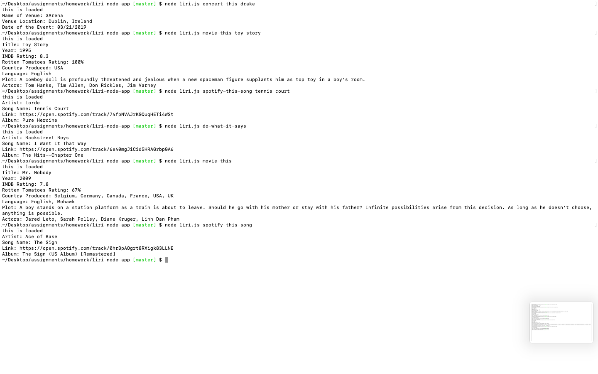

# liri-node-app
# GIPHY-API
* Application
    - Enter commands with a designated subject to get more info
        - Commands and Info they Provide
            - node liri.js concert-this artist/band
                - Name of the next venue
                - Venue location
                - Date of the Event
            - node liri.js spotify-this-song song-name
                - Artist(s)
                - The song's name
                - A preview link of the song from Spotify
                - The album that the song is from
            - node liri.js movie-this movie-name
                - Title of the movie.
                - Year the movie came out.
                - IMDB Rating of the movie.
                - Rotten Tomatoes Rating of the movie.
                - Country where the movie was produced.
                - Language of the movie.
                - Plot of the movie.
                - Actors in the movie.
            - node liri.js do-what-it-says
                - Mystery Info :)
    -  Have fun!

* Technology used
    - JS
    - jQuery
    - Axios
    - Node.js
    - Moment.js

* Process
    - Establish pseudocode for the game
        - What it does
        - Determine responses
            - What API's used
            - Method to recieve arguments and return response
        - Axios link
            - Go through api to see where to pull from
    - Order in a manner which makes sense
    - Filling out the pseudocode
    - Testing for problems
        - Links
        - Code
        - API pulls
    - Writing out a solid README.md

### Link to Deployed Page

https://ctghadiri.github.io/liri-node-app

### IMAGE of Final Product

### Learning Points
* A solid plan via pseudocoding saves time and energy
* Commenting areas that distinguish what you were working on helps significantly
* Establishing a clean and organized javascript 
    - Makes the entire process easier to understand
    - Helps with debugging
* Solid Google-Fu is indispensable

### Author

## Cyrus Ghadiri

### Acknowledgments

* UC BERKELEY BOOTCAMP TEAM
* https://www.npmjs.com
* API's
    - Bands in town
    - Spotify
    - OMDB
